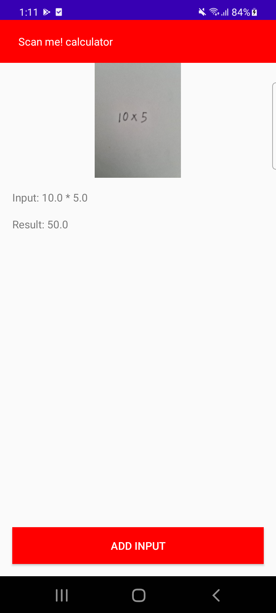
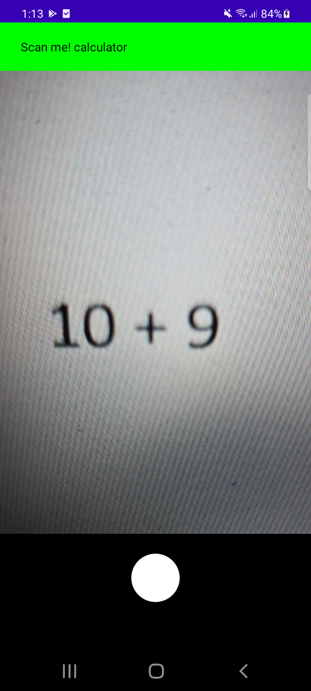

# Image-to-result (Scan me! calculator)

## Architecture
### App Architecture ([Recommended by android](https://developer.android.com/topic/architecture#recommended-app-arch)) - similar to clean.
`app` (presenation layer) - Layer that interacts with UI (MVVM)

`domain` (domain layer) - Models and interactors(usecase)

`data` (data layer) - Business logic

**Dependency Injection** - Hilt

**UI Paradigm** - Jetpack Compose

## Unit test
To run the unit test, run `./gradlew test` or run through Android Studio

## Note
Note that starting Android 11, denying the permission request more than twice
will prevent the system to display the permission request, if this happens due to testing
just uninstall and install the app or clear data.

## Screenshots
### Home

### File System

### Camera

